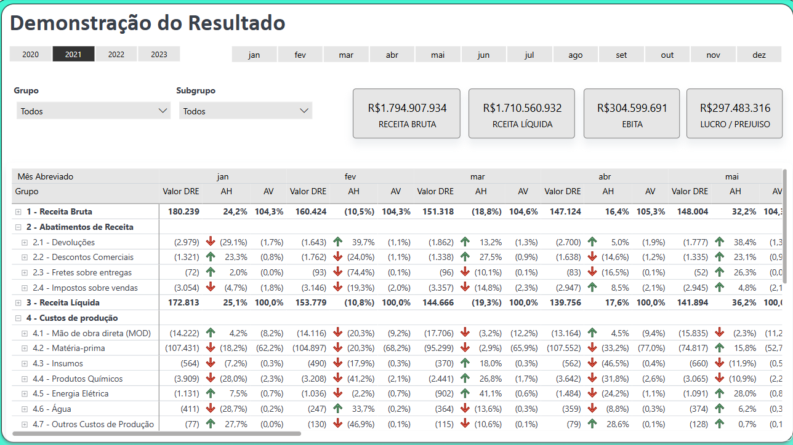
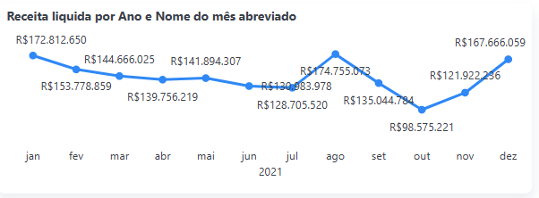
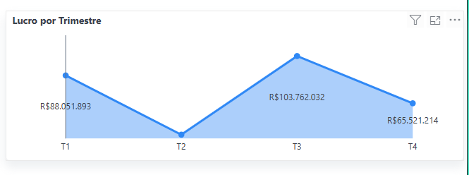
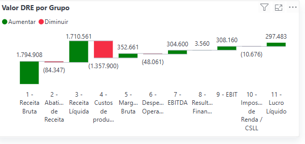
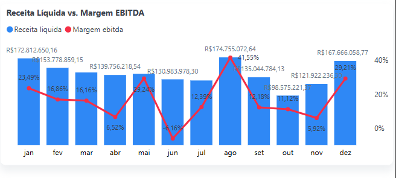

# 📊 Análise da Demonstração do Resultado (DRE) – Power BI

Este relatório apresenta a Demonstração do Resultado (DRE) com filtros por ano e mês, trazendo visões detalhadas de Receita Bruta, Receita Líquida, Custos de Produção, EBITDA e Lucro/Prejuízo, além de comparações mensais e por grupo.

## 🔍 Visão Geral

O painel possui duas abas principais:
- **DRE Detalhada:** Tabela dinâmica com os valores mensais da DRE e KPIs superiores.
- **Análises Gráficas:** Gráficos de linha, área e cascata que facilitam a análise visual.

---

## 🧾 1. Tabela Detalhada DRE



**Descrição:**  
Tabela completa da DRE com detalhamento por grupo e subgrupo, apresentando valores mensais, variações percentuais (AV/AH) e totais. Os KPIs superiores (Receita Bruta, Receita Líquida, EBITDA e Lucro/Prejuízo) fornecem uma visão executiva consolidada.

**Análise:**  
- A Receita Bruta mensal foi de R$180.239 mil em jan/21 e variou ao longo do ano.
- Os Abatimentos reduziram a Receita Bruta, com destaque para Impostos e Devoluções.
- Os Custos de Produção, como Matéria-prima e Energia, impactam fortemente a Receita Líquida.
- O EBITDA e Lucro são calculados após as deduções de custos e despesas.

---

## 📈 2. Receita Líquida Mensal



**Descrição:**  
Gráfico de linha que mostra a evolução da Receita Líquida mês a mês durante o ano de 2021.

**Análise:**  
- A maior Receita Líquida ocorreu em ago/21 (R$174.755.072).
- A menor foi em out/21 (R$98.575.221), indicando possível sazonalidade ou queda de demanda.
- Dez/21 recuperou bem, fechando o ano com R$167.666.059.

---

## 📊 3. Lucro por Trimestre



**Descrição:**  
Gráfico de área com o Lucro líquido por trimestre.

**Análise:**
- O T3 teve o melhor desempenho com R$103.762.032.
- O T2 foi o pior trimestre, com o lucro mais baixo (R$41.250.000 aprox.), exigindo análise dos custos operacionais e de produção.

---

## 🧱 4. Valor DRE por Grupo (Gráfico Cascata)



**Descrição:**  
Gráfico cascata que mostra o impacto de cada grupo no valor final do lucro/prejuízo.

**Análise:**
- Receita Bruta inicia o gráfico com R$1.794.908 mil.
- Os maiores impactos negativos são de Custos de Produção (R$1.357.900 mil).
- A Receita Líquida (R$1.710.561 mil) se mantém robusta, resultando em um lucro líquido de R$297.483 mil após todos os ajustes.

---

## 📉 5. Receita Líquida vs Margem EBITDA



**Descrição:**  
Gráfico combinado de colunas (Receita Líquida) e linha (Margem EBITDA).

**Análise:**
- A melhor Margem EBITDA foi em ago/21 (41,55%), acompanhando o pico de receita.
- A pior margem foi em jun/21 (3,16%), sinalizando possíveis aumentos de custo ou baixa produtividade.
- Dez/21 também apresentou forte desempenho com alta margem (29,21%).

---

## ✅ Conclusão

O relatório permite uma análise clara da performance financeira da empresa ao longo do ano, identificando:
- Sazonalidades de receita.
- Picos e quedas de lucratividade.
- Grupos que mais impactam no resultado final.

---

## 📁 Estrutura de Pastas

```
DRE/
│
├── README.md
├── DRE.pbix
├── FatosDRE
└── images/
    ├── 01_tabela_dre.png
    ├── 02_receita_liquida_mensal.png
    ├── 03_lucro_trimestre.png
    ├── 04_valor_dre_grupo.png
    └── 05_receita_margem_ebitda.png
    └── imagem.png
```
## 📄 Licença

Este projeto está licenciado sob a **Licença MIT** — veja o arquivo [LICENSE](LICENSE) para mais informações.

---

## 👤 Autor

**Tiago Fonseca**
